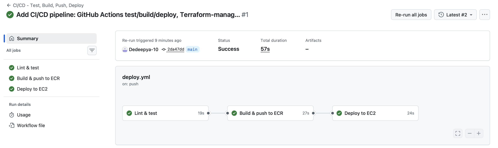
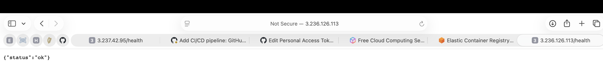
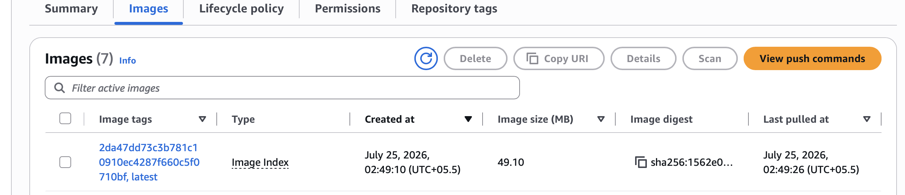

# Round 2 Task Submission — Notes

This is my write-up for the Round 2 task (CI/CD Pipeline & Automation). Same
as last time, the README.md has the full technical reference — this is the
walkthrough of what I actually did and why, plus the screenshots.

## What this round adds

Round 1 was all manual: I built the image myself, pushed it to ECR myself,
ran Terraform myself. The point of Round 2 was to take all of that and put
it behind a GitHub Actions workflow, so a normal `git push` to `main` is the
only thing anyone has to do — the pipeline handles testing, building,
pushing, and redeploying to EC2 on its own.

## Testing strategy

The task asked for at least one of unit tests, linting, or security
scanning. I added two — ESLint and a couple of Jest/Supertest tests — since
neither takes much effort on an app this small, and they catch different
kinds of mistakes. ESLint catches syntax and style problems before the app
even runs. The Jest tests actually hit the two routes (`/` and `/health`)
through Supertest and check the response shape, which matters because the
Docker `HEALTHCHECK` and the deploy job's own health check both depend on
`/health` actually returning what it's supposed to.

To make the app testable without spinning up a real server, I split
`server.js` into two files — `app.js` exports the Express app itself, and
`server.js` just imports it and calls `.listen()`. Supertest can then hit
the app directly in-process without binding a port.

Both run as a required step before anything gets built:

```
npm run lint
npm test
```

If either one fails, the workflow stops there — it never reaches the build
or deploy jobs, so a broken commit can't end up running in production.

## The pipeline itself

Three jobs, each depending on the last one succeeding:

1. **Lint & test** — runs on every push and every pull request.
2. **Build & push to ECR** — only runs on an actual push to `main` (not on
   PRs). Builds the image with `docker buildx build --platform linux/amd64`
   and pushes it to ECR under two tags: `latest` and the commit SHA. Tagging
   with the SHA means I can always tell exactly which commit is running on
   the server, instead of `latest` just silently pointing at whatever was
   pushed most recently.
3. **Deploy to EC2** — SSHes into the instance, pulls the SHA-tagged image,
   removes the old container, starts the new one, and checks `/health`
   before finishing.

Here's a run where all three passed:



## Monitoring / how I checked it actually worked

A few different signals, not just "the workflow went green":

- `docker inspect`'s health status on the instance reports `healthy`
- The container's own logs show a clean startup (`App listening on port 3000`, no crash loop)
- The container ID changes after each deploy, which is a simple way to
  confirm the box is actually running a freshly-deployed container and not
  something left over from before
- Hitting `/health` from outside the box, after deployment, to confirm it's
  reachable over the network and not just responding to localhost on the
  instance itself



And the image in ECR with the new commit-SHA tag next to `latest`:



## The SSH access problem, and how I solved it

This was the part I spent the most time thinking about. GitHub-hosted
runners don't come from a small, predictable IP range — there's no single
CIDR block I could add to the security group once and be done with it. The
easy way out would've been to just open port 22 to the whole internet, but
that felt wrong to hand in as "the answer."

What I did instead: the deploy job looks up its own public IP right at the
start of the run, adds a security-group rule scoped to just that one IP for
just port 22, does the SSH deploy, and then removes that rule again in a
cleanup step. That cleanup step is marked `if: always()`, so it still runs
and closes the door even if the deploy itself fails partway through — the
instance isn't left with an open port because something crashed mid-run.

## Terraform changes

The task specifically asked for Terraform to manage the SSH key pair
instead of one created by hand. In Round 1 I'd created the key pair directly
with `aws ec2 create-key-pair` on the CLI. For Round 2 I replaced that with
a `tls_private_key` resource feeding into an `aws_key_pair`, and exposed the
private key as a (sensitive) Terraform output. That output is what gets
copied into the `EC2_SSH_KEY` GitHub Secret.

This turned out to matter more than I expected — with the manual approach,
if the instance ever got recreated, there was no built-in way to know
whether the `.pem` file sitting on my laptop still matched the key the new
instance actually trusted. With Terraform generating it, the secret and the
instance can't silently drift apart, since they both come from the same
`terraform apply`.

## Challenges I ran into

The security group one above was the main design challenge. A couple of
smaller ones came up while actually getting this working:

- The first access token I used to push didn't have the `workflow` scope,
  and GitHub specifically blocks pushes that touch `.github/workflows/*`
  without it — a plain `repo` scope isn't enough for that one path. Had to
  regenerate the token with `workflow` added.
- The AWS access key used for `AWS_ACCESS_KEY_ID` / `AWS_SECRET_ACCESS_KEY`
  needed to come from an account with MFA enabled, which meant there was a
  bit of a wait between having everything else ready and actually getting a
  full green run — the `build-and-push` and `deploy` jobs both failed with
  "Credentials could not be loaded" until those two secrets existed. Not a
  bug, just a sequencing thing.
- Reused the Round 1 lesson about `arm64` vs `amd64` here too — the build
  step in the workflow always passes `--platform linux/amd64` explicitly,
  same reason as before: the EC2 instance is a standard x86_64 box, and
  Docker images aren't portable across CPU architectures by default.

## What I'd improve given more time

- Right now a failed deploy doesn't automatically roll back to the previous
  image — you'd have to notice and redeploy the last-known-good SHA by hand.
  A rollback step (or blue/green deployment, which the task called out as
  optional) would be the natural next thing to add.
- Logs currently live on the instance itself and in the GitHub Actions run
  history. Shipping them to CloudWatch would make them easier to search
  after the fact instead of having to SSH in.
